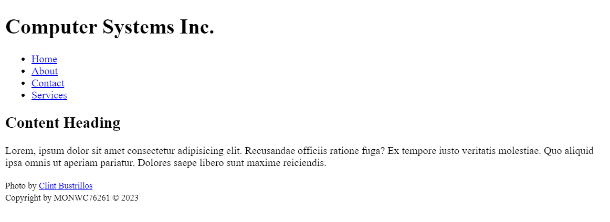

# Lesson 7 Project
The client from your previous lesson was impressed by your work and has hired you again. Within the next few weeks, they will be working with you closely to create a website for their new computer company.

They have worked with you previously to create a template, now they have provided you with instructions on how to style the page. They plan to use the same style and structure for all pages on their website, with stylistic changes to each web page so the content on the page appears unique but the structure of the web page is uniform across the entire site.

It is imperative for this lesson that you **preview** your template page in VS Studio Code so that you can see your changes in real time. The preview panel in VS Code will automatically update your website every time you save your page in VS Code, therefore you should save after each change you make.

## Project Prep
1. If you haven't done so already, clone the repo to your computer within your course folder.
2. Open the repo within VS Code. You can open this `readme.md` file within VS Code to view the project directions there. 

   > **TIP:** Right click on the file and choose the `Open Preview` option.
3. If there are files and folders present other than this `readme.md` file, take some time to familiarize yourself with the files within the repo so you know where they are located. This will help you when asked to use them within the project directions.

   > **TIP:** Before beginning any work on the project, read through all the steps to understand what you will be doing.

***
**IMPORTANT: Be sure to Save and Sync your work to GitHub regularly, applying appropriate Commit comments as you go.**
***

1. Using the Explorer Pane in VS Code, create a subfolder called: **images**.

    > **TIP:** See [How To: Create a Subfolder in VS Code](https://riosalado.coursearc.com/content/cis133da-in-v12/lesson-6-links-lists-and-images/inserting-images#vssubfolder) if you need help creating a subfolder.
0. Move the **background.jpg** file included in the repo to your **images** subfolder.

## Adjust the Template

1. Open the **template.html** file and update the following within the HEAD:
   - Within the HTML comment, add your section number and the lesson number.
   - Add your first and last name as the author.
   - Replace the TITLE with `Lesson 7 Project`.
2. Add an unordered list to the navigation element.
   - Add four list items and add a placeholder link to each list item so that you have a total of four links.
   - Change the display text to the links to display the following pages:
      - Home
      - About
      - Contact
      - Services
   - Do not change the target page for each link, as you'll be adding working links as you move on.
3. Within the footer include the following: 
      - Add a caption for an image **on a separate line** within the already existing paragraph that displays: `Photo by Clint Bustrillos`. Link the source of the image using creator of the image as the display text. Image source: `https://unsplash.com/@clintbustrillos`
      - Update your MEID and, if necessary, the year.
      - Apply an appropriate text-level semantic element so *all* copyright information displays as small print.
   > **TIP:** See the example image below.

## Example Project
This is an example of what the project should look like at this point in the lesson.

## Style the Template

For the next steps you will need to apply appropriate CSS declaration blocks and selectors to style the page according to the directions. For any CSS property values not specifically defined for you, you will need to determine the value on your own. 

Use this as your opportunity to experiment with padding, margins etc. to adjust the look and feel of the web page! Also, you will have an opportunity in a few steps to select your own background and text colors. Use the [Rio Salado Color Picker Tool](https://riosalado.coursearc.com/content/cis133da-in-v12/lesson-5-introduction-css/rio-salado-college-color-tool/) if you need help selecting your colors.

1. Add an internal style sheet to the appropriate section.
2. Style the body to:
   - Specify the text font as a set of sans-serif styled fonts.
   - Set the default font-size to 100%.
3. Add a CSS comment that displays: **Header Styles**
4. Style the header to:
   - Apply a background image using the background.jpg image provided to you.
   - Set the background so it does not repeat
   - Center position the background
   - Adjust the background size to cover the entire element.
   - Apply a top padding of your choosing.
   - Apply a bottom padding of 0.
   - Remove all margins.
0. Style the first-level heading to:
   - Specify the text font as a set of serif styled fonts.
   - Center align the text.
   - Set the text color to white using a color method of your choosing.
   - Add a top and bottom padding.
   - Remove all margins.
0. Add a CSS comment that displays: **Navigation Bar Styles**
0. Style the unordered list within the navigation element to:

   > **TIP:** Create an appropriate selector that targets only the unordered list within the navigation element. If you do not, any future lists you add to your page will be given the same styles you apply to your navigation bar.
   - Remove the bullets from the list.
   - Add a background color using a color method of your choosing.
   - Apply the <code>overflow: hidden;</code> property 
     > **TIP:** As a reminder, the <code>overflow: hidden;</code> property is added to prevent the list items from going outside the navigation bar.
   - Remove the margin and paddings for all sides of the element.
0. Style the list items within the navigation element to: 
   - Float the elements to the left.
0. Style the links within the navigation element to:
   - Display the element to appear as block elements.
     > **TIP:** This will allow you to specify the box model (height, width, padding, margins, etc.)
   - Set the text color to white using a color method of your choosing.
   - Remove the underline below each link.
   - Define the padding on all sides to the same value.
0. Style the hover state of the navigation links to:
   - Add a background color of your choosing.
     > **TIP:** This should change the background color of the links when a user moves their mouse to hover over the links.
0. Add a CSS comment that displays: **Main Styles**
0. Style the main element to:
   - Define the padding on all sides to the same value.
0. Add a CSS comment that displays: **Footer Styles**
0. Style the footer to:
   - Add a background color of your choosing.
   - Set the text color to white using a color method of your choosing.
   - Define the padding on all sides to the same value.
   - Center align the text.
0. Style the links within the footer to:
   - Set the text color to white using a color method of your choosing.

 ## Example Project
 Below is a rendering of an example project. Your page may look slightly different depending on your color, font, and spacing choices. 

## Submit the Project
Once you have completed your project, you need to let your instructor know that it is ready to be graded. This is done by submitting the Repo URL to the assignment in RioLearn.

   > **TIP:** If you need a refresher on how to submit your work, view: [Submitting Assignments & Viewing Feedback](https://riosalado.coursearc.com/content/cis-public/git-github-and-vs-code/submitting-assignments-and-viewing-feedback).
1. Review your work and make any necessary updates. Save the file. You can either select **FILE>SAVE** or use the keyboard shortcut **CTRL+S**.
2. **Sync** the changes and apply a final **Commit** that says: `Completed final review and updates before submission.`
3. Verify that all files appear on GitHub.

   > **TIP:** You can view any of your repos by going to the GitHub organization for the course - [RSC-CIS133DA-IN-V12 Organization](https://github.com/rsc-cis133DA-in-v12). Once you are viewing the class organization, you should see all of the Repos that you have accepted assignment invitations for. It is recommended that you bookmark this page for future reference. Push (i.e., sync) the files on your computer with GitHub to ensure all files are uploaded to GitHub for your instructor to view.
4. Right-click the link to your repository and select **Copy Link Address**.
5. Go to the Assessing Your Learning page in your RioLearn lesson, and click the link to submit the assignment. Paste the link to your repo in the assignment submission box.
